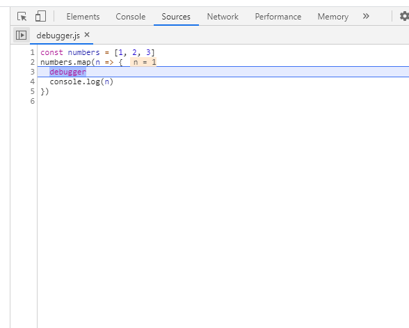
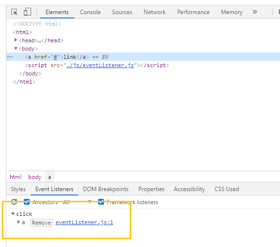

JavaScriptをデバッグする方法をいくつかまとめました。

1. JSのdebuggerステートメント
1. JSのconsole.trace関数
1. ChromeデベロッパーツールのEvent Listenersタブ

検証リポジトリ: https://github.com/cuavv/sandbox-js-debug

## debuggerステートメント

ページを表示すると、debuggerステートメントを記述した箇所で処理が止まります。デベロッパーツールのSourcesタブでブレークポイントを任意の位置に設定したときと同じ挙動になります。

```js
const numbers = [1, 2, 3]
numbers.map((n) => {
  debugger
  console.log(n)
})
```



## console.trace関数

`console.trace()` を記述した関数がどこから呼び出されたのか追跡できます。例では「console.traceを呼び出したのは関数a」「関数aを呼び出したのは関数b」ということがわかります。

```js
const a = () => {
  console.log('a')
  console.trace()
}

const b = () => {
  a()
}

b()
```


参考: https://postd.cc/how-to-not-hate-javascript-tips-from-the-frontline/

## Event Listenersタブ

デベロッパーツールのElementsタブで該当のHTML要素を選択すると要素に設定されたイベントリスナーとコールバック関数が定義されている箇所が表示されます。例ではaタグに設定されたclickイベントのコールバック関数がeventListener.jsで定義されていることがわかります。

```html
<a href="#">link</a>
```

```js
document.querySelector('a').addEventListener('click', () => {
  console.log('clicked')
})
```



参考: https://ics.media/entry/190517/
