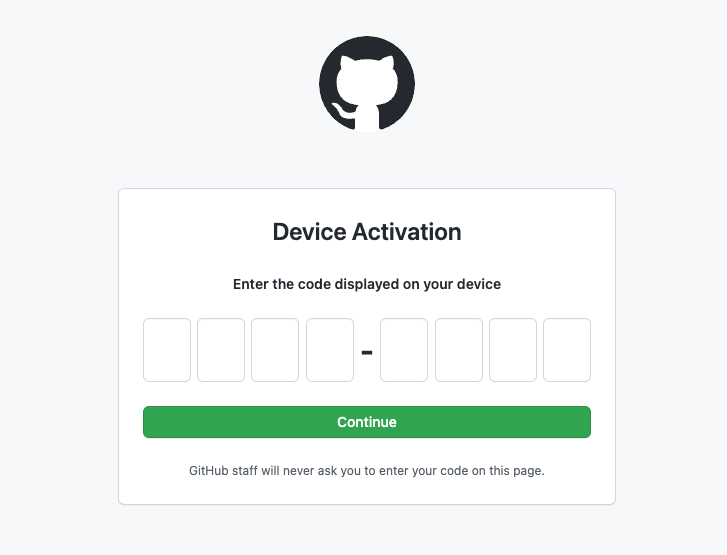

## GitHub CLI とは

GitHub をターミナルやスクリプトから操作するための CLI です。色々できます。

**Core commands**

| コマンド     | 説明                                   |
| ------------ | -------------------------------------- |
| gh auth      | GitHub で gh と git を認証する         |
| gh browse    | Web ブラウザで GitHub リポジトリを開く |
| gh codespace | Codespace に接続して管理する           |
| gh gist      | gists を操作する                       |
| gh issue     | イシューを操作する                     |
| gh pr        | PR を操作する                          |
| gh release   | リリースを管理する                     |
| gh repo      | リポジトリを操作する                   |

**Actions commands**

| コマンド    | 説明                                                                            |
| ----------- | ------------------------------------------------------------------------------- |
| gh run      | GitHub Actions から実行された最近のワークフローを一覧表示、表示、および監視する |
| gh workflow | GitHub Actions でワークフローを一覧表示、表示、実行する                         |

**Additional commands**

| コマンド      | 説明                                                                                      |
| ------------- | ----------------------------------------------------------------------------------------- |
| gh alias      | エイリアスを使用して、gh コマンドのショートカットを作成したり、複数のコマンドを作成したり |
| gh api        | GitHub API に対して認証済みの HTTP リクエストを作成し、レスポンスを出力する               |
| gh completion | GitHubCLI コマンドの shell completion scripts を生成する                                  |
| gh config     | gh の構成設定を表示または変更する                                                         |
| gh extension  | 拡張機能を追加する                                                                        |
| gh gpg-key    | GitHub アカウントに登録されている GPG キーを管理する                                      |
| gh label      | ラベルを操作する                                                                          |
| gh search     | GitHub 全体を検索する                                                                     |
| gh secret     | secret をリポジトリまたは組織レベルで設定する                                             |
| gh ssh-key    | GitHub アカウントに登録されている SSH キーを管理する                                      |
| gh status     | サブスクライブしているすべてのリポジトリにわたって、GitHub での作業に関する情報を出力する |

https://cli.github.com/manual/gh

## 検証環境

- M1 MBP@12.4
- gh@2.12.1 (GitHub CLI)

## インストール

Homebrew、MacPorts、Conda、Spack を経由してインストールできます。また[releases page](https://github.com/cli/cli/releases/latest)からバイナリをダウンロードすることが可能です。今回は Homebrew でインストールします。

```sh
$ brew install gh
```

https://github.com/cli/cli#macos

## 構成

CLI の認証を行います。以下のコマンドを実行します。

```sh
$ gh auth login
```

いくつか質問されるので回答していきます。

```
? What account do you want to log into?  [Use arrows to move, type to filter]
> GitHub.com
  GitHub Enterprise Server
? What is your preferred protocol for Git operations?  [Use arrows to move, type to filter]
> HTTPS
  SSH
? Authenticate Git with your GitHub credentials? (Y/n) Y
? How would you like to authenticate GitHub CLI?  [Use arrows to move, type to filter]
> Login with a web browser
  Paste an authentication token
? How would you like to authenticate GitHub CLI? Login with a web browser

! First copy your one-time code: XXXX-XXXX
Press Enter to open github.com in your browser...
```

Enter を押すとブラウザで GitHub の Device Activation ページが表示されます。提示された one-time code(`XXXX-XXXX`の部分)を Device Activation ページのフォームに入力して Continue をクリックします。



CLI が要求するアクセス権限のリストが表示されます。問題なければ Authorize gitHub をクリックします。


認証が完了しました。ターミナルに完了メッセージが表示されます。


```
Press Enter to open github.com in your browser...
✓ Authentication complete.
- gh config set -h github.com git_protocol https
✓ Configured git protocol
✓ Logged in as cuavv
```

https://cli.github.com/manual/

## 動作確認

以下の条件でリポジトリの一覧を取得して JSON に整形してみます。

- リポジトリ内で最も使われている言語が TypeScript

JSON に出力するフィールドを指定します。

- リポジトリ名 (`name`)
- リポジトリ内で最も使われている言語 (`primaryLanguage`)
- リポジトリ内で使われている全ての言語とそのサイズ (`languages`)
- 所有者 (`owner`)
- 作成日時 (`createdAt`)
- 更新日時 (`updatedAt`)

```sh
$ gh repo list --language typescript --json name,primaryLanguage,languages,owner,createdAt,updatedAt
```

```json
[
  {
    "createdAt": "2022-06-03T14:21:00Z",
    "languages": [
      {
        "size": 1110,
        "node": {
          "name": "JavaScript"
        }
      },
      {
        "size": 1271,
        "node": {
          "name": "TypeScript"
        }
      }
    ],
    "name": "sandbox-cdk-ts",
    "owner": {
      "id": "MDQ6VXNlcjU3NTM0Mzc0",
      "login": "cuavv"
    },
    "primaryLanguage": {
      "name": "TypeScript"
    },
    "updatedAt": "2022-06-11T16:40:44Z"
  },
```

取得できました 👏
