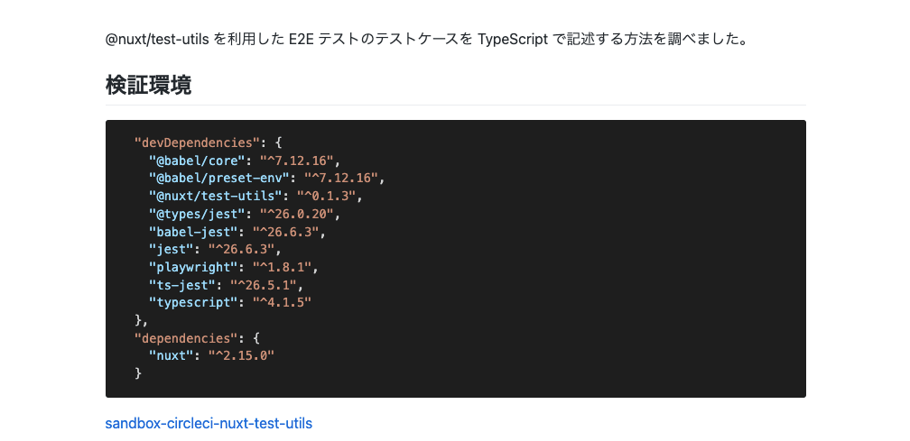
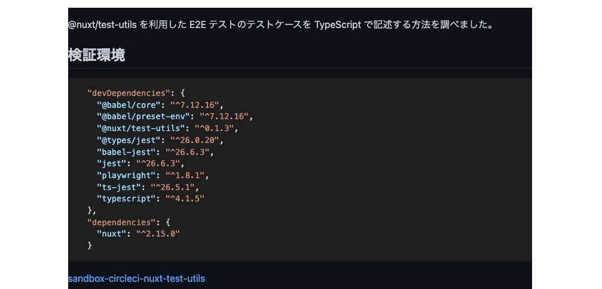
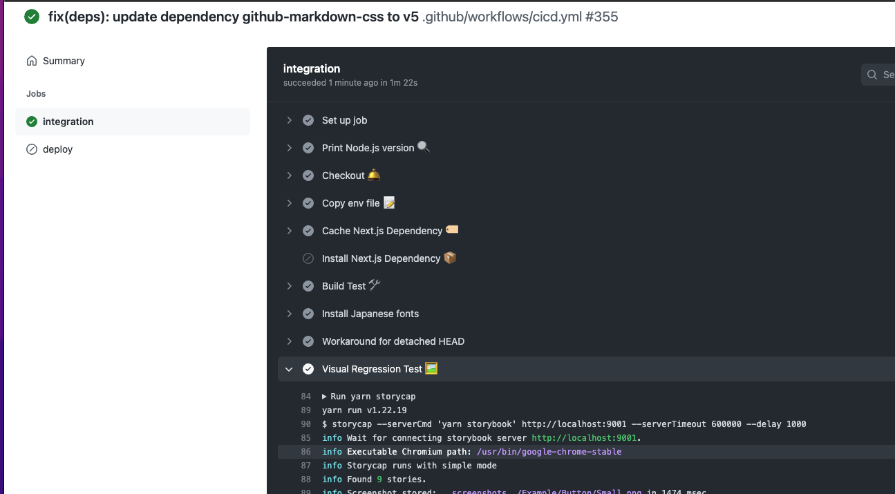
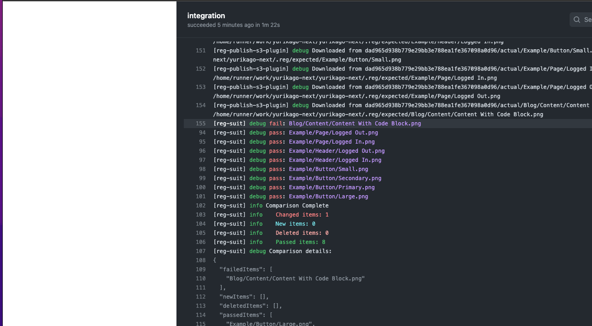
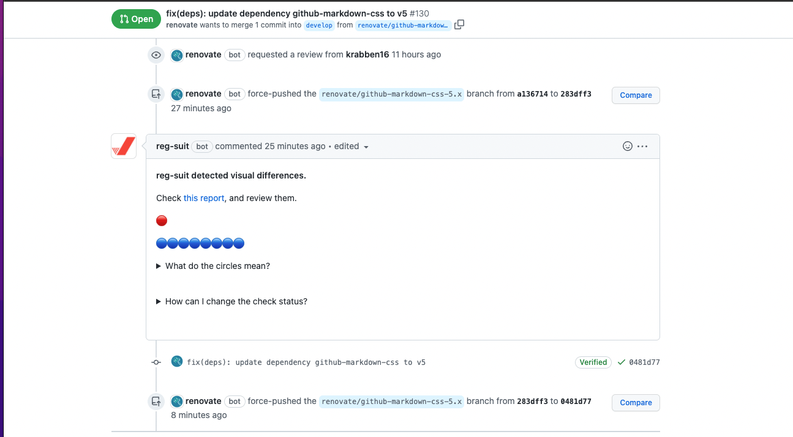
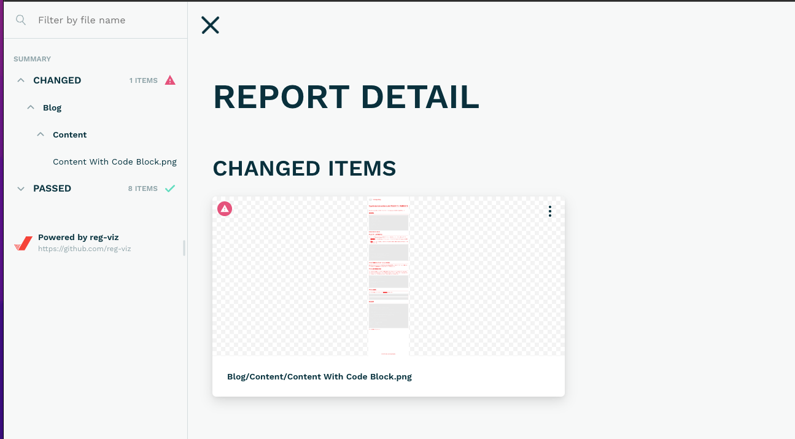
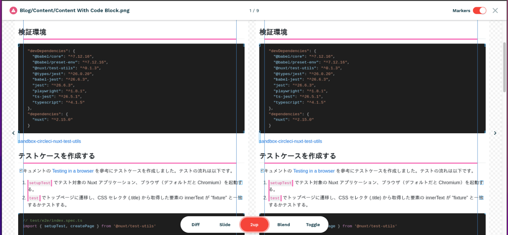

## はじめに

趣味で開発しているプロダクトのライブラリアップデートの自動化に Renovate を使っています。マイナー/パッチアップデートの場合はアプリケーションの動作確認をユニットテストに任せていましたが、メジャーアップデートの場合は動作確認を手動で行なっていました。

あるとき github-markdown-css を 4.0.0 から 5.1.0 に変更して動作確認していると「エラーではないけど見た目が変わってしまっている」というアップデートの影響を見つけました。



<p class="text-center text-gray-500 italic">before</p>



<p class="text-center text-gray-500 italic">after(なぜか背景が黒くなる)</p>

ユニットテストや Next.js のビルドでエラーにならないので目視で確認しないと気付きませんでした。こういった影響をライブラリをアップデートするたびに手動で確認するのは手間だなと思ったので、ある程度自動化できないかと思い方法を調べました。今回は以下の記事を参考に Visual Regression Test を使って視覚的な変化を検知する方法を試しました。

参考: https://blog.nnn.dev/entry/2021/04/30/110000

## Visual Regression Test (VRT) とは

こちらの記事が詳しいです。

> Visual Regression Test(VRT)とはその名の通り、視覚的にリグレッションテストを行うことです。
> フロントエンドの開発者、そうでなくても HTML や CSS の修正作業をすることのあるエンジニアの方は下記のような問題に遭遇することがあるのではないでしょうか。
>
> - あるコンポーネントの CSS を変更しただけのつもりだったのに、なぜか他のページのレイアウトが崩れてしまった
> - デザインのレイアウトルールが変わったので、共通で使用している CSS を修正する必要があるが、影響のあるコンポーネントが正常に表示されるか全てを確認することが難しい、結果的に「えいや」でリリースせざるを得ない
>
> 通常のロジックのリグレッションテストであれば、自動テストなどで担保できますが、HTML や CSS などのレイアウトなどの視覚面の実装に関しては、人の目で差分が想定通りか確認する必要があります。
> この面倒な作業をできる限り自動化してくれる解決策が、Visual Regression Test です。

参考: https://zenn.dev/toshiokun/articles/3d7087b84ba1d9

## やること

- Next.js アプリケーションへの Storybook, Storycap, reg-suit の追加
- Storycap のスナップショットを保存する S3 バケットの作成
- Visual Regression Test を CI（GitHub Actions）で実行する環境構築

## 実行環境

- yarn@1.22.19
- npm packages
  - next@12.1.6
  - @storybook/react@6.5.9
  - storycap@3.1.9
    - puppeteer@13.4.0
  - reg-suit@0.12.1

## ライブラリのセットアップ

### Storybook の追加

参考記事の手順でほとんど対応できたので省略します。

```json title="package.json"
    "storybook": "start-storybook -p 9001",
```

背景色が変化しているあたりのコンポーネントをストーリー（`Content With Code Block`）として作成しました。


参考: https://zenn.dev/minguu42/articles/20211226-nextjs-storybook

### Storycap の追加

```shell
% yarn add storycap
```

```json title="package.json"
    "storycap": "storycap --serverCmd 'yarn storybook' http://localhost:9001 --serverTimeout 600000 --delay 1000",
```

リソースの取得やページのレンダリングの完了を待機するため`--delay`オプションを指定しました。デフォルトだと`__screenshots__`ディレクトリにスナップショットが出力されます。

参考: https://github.com/reg-viz/storycap#install

### reg-suit の追加

```shell
% yarn add reg-suit
% yarn reg-suit init
```

いくつか質問に答えて設定ファイルを作成します。

```json title="regconfig.json"
{
  "core": {
    "workingDir": ".reg",
    "actualDir": "__screenshots__",
    "thresholdRate": 0.001,
    "addIgnore": true,
    "ximgdiff": {
      "invocationType": "client"
    }
  },
  "plugins": {
    "reg-keygen-git-hash-plugin": true,
    "reg-notify-github-plugin": {
      "prComment": true,
      "prCommentBehavior": "default",
      "clientId": "<クライアントID>",
      "setCommitStatus": false
    },
    "reg-publish-s3-plugin": {
      "bucketName": "<S3バケット名>"
    }
  }
}
```

reg-suit の実行結果を PR のステータスに反映させないよう`setCommitStatus`を無効にしました。これが true だと、意図した変更なのにステータスが赤い PR をマージすることになり正常な感覚を失う恐れがあるためです。（N 予備校のエンジニアの方の受け売り）

```json title="package.json"
    "regression": "reg-suit run"
```

参考: https://blog.wadackel.me/2018/storybook-chrome-screenshot-with-reg-viz/#reg-suit

## S3 バケットの作成

reg-suit を実行したときにスナップショットをアップロードする S3 バケットを作成します。

- オブジェクト所有者の設定
  - ACL 有効、オブジェクト所有者は`希望するバケット所有者`とする。
- パブリックアクセスの設定
  - 以下の二つにチェック
    - `新しいパブリックバケットポリシーまたはアクセスポイントポリシーを介して付与されたバケットとオブジェクトへのパブリックアクセスをブロックする`
    - `任意のパブリックバケットポリシーまたはアクセスポイントポリシーを介したバケットとオブジェクトへのパブリックアクセスとクロスアカウントアクセスをブロックする`

参考: https://zenn.dev/toshiokun/articles/3d7087b84ba1d9#%E3%82%A2%E3%83%83%E3%83%97%E3%83%AD%E3%83%BC%E3%83%89%E5%85%88%E3%81%AEs3%E3%81%AE%E6%BA%96%E5%82%99%E3%82%92%E3%81%99%E3%82%8B

### S3 バケットに書き込みできる IAM ユーザーの作成

上記で作成したバケットしか操作できないインラインポリシーをアタッチしました。このユーザーのクレデンシャルを使って reg-suit を実行します。

## CI の設定

アプリケーションを修正するたびに VRT を手動で実行するのは手間なので CI で実行するようにします。想定しているフローは以下です。

1. Renovate がライブラリアップデートのブランチと PR を作成
2. CI が動いてライブラリがアップデートされた状態のアプリケーションのスナップショットを作成
3. 基点ブランチのスナップショットと Renovate が作成したブランチのスナップショットを比較して PR に通知

CI では作成した IAM ユーザーのクレデンシャルを環境変数に設定する必要があります。（`AWS_ACCESS_KEY_ID`, `AWS_SECRET_ACCESS_KEY`の部分）

### secret の読み込み

クライアント ID と S3 バケット名は環境変数を経由して読み込むようにしました。

```yaml title="cicd.yml"
env:
  REG_SUIT_CLIENT_ID: ${{ secrets.REG_SUIT_CLIENT_ID }}
  REG_SUIT_S3_BUCKET_NAME: ${{ secrets.REG_SUIT_S3_BUCKET_NAME }}
  AWS_ACCESS_KEY_ID: ${{ secrets.AWS_ACCESS_KEY_ID }}
  AWS_SECRET_ACCESS_KEY: ${{ secrets.AWS_SECRET_ACCESS_KEY }}
```

```json title="regconfig.json"
  "plugins": {
    "reg-keygen-git-hash-plugin": true,
    "reg-notify-github-plugin": {
      "prComment": true,
      "prCommentBehavior": "default",
      "clientId": "$REG_SUIT_CLIENT_ID", # 環境変数 REG_SUIT_CLIENT_ID の値を参照する
      "setCommitStatus": false
    },
    "reg-publish-s3-plugin": {
      "bucketName": "$REG_SUIT_S3_BUCKET_NAME"
    }
  }
```

参考: https://qiita.com/eretica/items/080cf75f8b9d2d928799

### 切り離された HEAD の回避策

README の CI セクションに記述されている設定を追加します。

```yaml title="cicd.yml"
- uses: actions/checkout@v2
  with:
    fetch-depth: 0
```

```yaml title="cicd.yml"
- name: workaround for detached HEAD
  run: |
    git checkout ${GITHUB_REF#refs/heads/} || git checkout -b ${GITHUB_REF#refs/heads/} && git pull
```

参考: https://github.com/reg-viz/reg-suit#run-with-ci-service

この設定がないと reg-suit の実行時に前回のスナップショットを検出できず比較がスキップされてしまいます。

参考: https://github.com/reg-viz/reg-suit/issues/186

### 日本語フォントの追加

Storycap で取得するスナップショットの日本語が文字化けするので日本語フォントを追加します。

```yaml title="cicd.yml"
- name: Install Japanese fonts
  run: |
    sudo apt install fonts-ipafont fonts-ipaexfont
```

参考: https://www.pnkts.net/2021/10/14/chromium-chromedriver-japanese

## VRT の実行

CI の発火条件は以下を設定しました。何かしらコミットをプッシュすれば CI が発火します。

```yaml title="cicd.yml"
on:
  push:
```

VRT のジョブは以下を設定しました。

```yaml title="cicd.yml"
- name: Visual Regression Test
  run: |
    yarn storycap
    yarn regression
```

1. Storycap を実行してストーリーのスナップショットを作成します。
2. reg-suit を実行して前回と今回のスナップショットの比較を行います。
   - 前回のスナップショットを S3 バケットから取得します。
   - 今回のスナップショットを S3 バケットにアップロードします。

実際に VRT のジョブを実行しました。



ログに以下の文言が出力されています。`Content With Code Block`の変化が検知されているのではないでしょうか！？

```
[reg-suit] debug fail: Blog/Content/Content With Code Block.png
:
[reg-suit] info    Changed items: 1
```



### PR への通知

ジョブが完了すると比較結果が PR にコメントされます。Changed items は赤い丸として表示されます。コメントの`this report`をクリックすると比較結果のレポートを閲覧できます。



### 比較結果のレポート

CHANGED ITEMS に`Content With Code Block`が表示されています。ライブラリをアップデートして背景が黒くなったことが検知されているに違いありません。



実際にどういうスナップショットが比較されたのか見てみましょう。CHANGED ITEMS のサムネイルをクリックします。



<p class="text-center text-gray-500 italic">左：基点ブランチ 右：Renovateブランチ</p>

左が基点ブランチのスナップショット、右が Renovate が作成したブランチのスナップショットです。………ライブラリをアップデートした後のスナップショットなのに背景が黒くないですね。

ちなみにローカル環境で Renovate ブランチを checkout して`next`コマンドを実行してみると背景は黒くなりました。ローカル環境と CI 環境の間に何らかの違いがあり、その違いが原因で背景が黒くなるかどうかが変化するようです 🤔

### CI 環境で背景が黒くならない原因

ローカル環境で背景を黒くしている CSS を確認すると background-color に変数`--color-canvas-default`が設定されていました。その値は`#0d1117`でした。


github-markdown-css のソースを確認するとメディアクエリの prefers-color-scheme が`dark`のときに上記の背景色が設定されるようです。

```css
@media (prefers-color-scheme: dark) {
  .markdown-body {
:
    --color-canvas-default: #0d1117;
```

参考: https://github.com/sindresorhus/github-markdown-css/blob/v5.1.0/github-markdown.css#L37

つまりブラウザのテーマがダークモードなら背景が黒くなり、ライトモードなら背景は黒くならないということです。実際、ブラウザのテーマをライトモードに変更してローカル環境で`next`コマンドを実行してみると背景は白くなりました。

### CI 環境で背景を黒くする方法

Storycap は内部で Puppeteer を使用しているようです。

参考: https://github.com/reg-viz/storycap#features

以下のように`emulateMediaFeatures`を実行すればダークモードでスナップショットを作成できそうな気がします。

```js
await page.emulateMediaFeatures([
  { name: 'prefers-color-scheme', value: 'dark' },
])
```

参考: https://design.dena.com/engineering/puppeteer-v2

ところが Storycap の CLI のオプションの中に`emulateMediaFeatures`を実行できそうなものはありませんでした。

参考: https://github.com/reg-viz/storycap#command-line-options

`--puppeteerLaunchConfig`は指定できますがその中で prefers-color-scheme を指定できそうなものはありませんでした。

参考: https://pptr.dev/#?product=Puppeteer&version=v13.4.0&show=api-puppeteerlaunchoptions

## 結論

CI 環境で Storycap の実行時にダークモードでスナップショットを作成できず、ローカル環境で発生する背景が黒くなる現象を再現できませんでした。なので「ライブラリをアップデートしたら背景が黒くなった」という今回のケースを VRT で検知することは難しそうという結論に至りました…。もしダークモードでスナップショットを作成する方法をご存じの方はぜひ教えていただきたいです。

## 感想

今回のようなケースでは VRT の真価を発揮できませんでしたが、冒頭で引用したように VRT を導入する価値があるケースはいくつかあります。

- あるコンポーネントの CSS を変更したら意図せず別のページのレイアウトが崩れたことを検知したい
- 共通で使っている CSS を修正したとき影響のあるコンポーネントの変化を検知したい

また VRT を CI で実行することで修正による影響の確認フローを自動化できます。PR を作ると基点ブランチと feature ブランチのスナップショットを比較して結果を PR にコメントするような仕組みを構築できます。

修正確認を手動で行うことに厳しさを感じている方は VRT を試してみてはいかがでしょうか。
